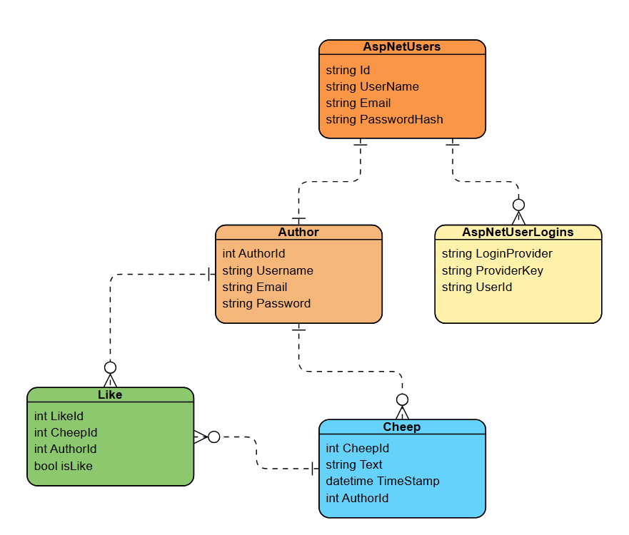

# Design and Architecture of _Chirp!

## Domain model
The domain model diagram illustrates the data structure of the Chirp application. It focuses on the relationships between the core entities: Author, Cheep, and Like, showing how users create messages and interact with them. Additionally, the diagram demonstrates the integration with ASP.NET Identity, which handles the GitHub authentication. This connection links the login data to the Author profile, ensuring that user identity is managed efficiently while keeping security separate from the application's logic.



## Architecture — In the small
### Infrastructre Project - Infrastructure

### ASP.NET Core Web App - Presentation
### Data Sources & Third Party Services - External Dependencies
## Architecture of deployed application
## User activities
## Sequence of functionality/calls through _Chirp!
# Process

## Build, test, release, and deployment
## Team work

### Project board
### Activity flow

## How to make _Chirp!_ work locally
Requirements to run _Chirp!_ locally:
* .NET 8.0.x SDK
* .NETCore 8.0.x Runtime
* AspNetCore 8.0.x Runtime

### Download and run
1) .NET 8 can be downloaded from the release page [releases page](https://github.com/ITU-BDSA23-GROUP13/Chirp/releases).
2) Extract the zip file.
3) Open the extracted folder in the terminal.
4) Run executable.

### Building from source
1) Clone the repository
```bash
git clone (https://github.com/ITU-BDSA2025-GROUP22/Chirp.git)
```
2) Change directory to the repository
```bash
cd Chirp
```
3) Run the project
```bash
dotnet run src/Chirp.Web
```
## How to run test suite locally
After completing the previous steps you can preceed by with the following
```bash
dotnet test
```

This will run every test using in-memory Sqlite databases.
# Ethics

## License
We use the MIT license
## LLMs, ChatGPT, Gemini, and others
ChatGPT and Gemini was used minimally, and no production code was copied directly from them. It was mainly used to clarify concepts and interpret error messages. Github copilot was also used for the same purpose of explaining error messages related to workflows. Stackoverflow and the official documentation often proved more efficient and reliable than AI suggestions since they have a very narrow context of the project.


