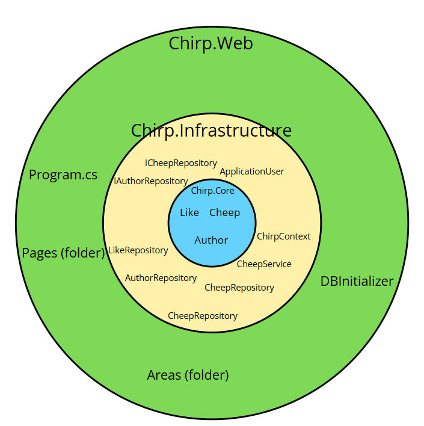
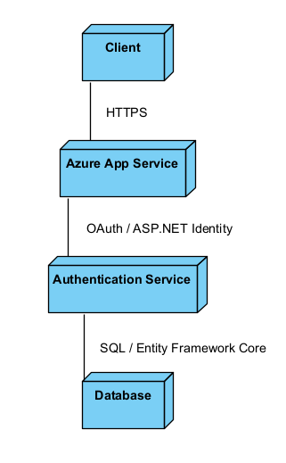

# Design and Architecture of _Chirp!

## Domain model


The domain model diagram illustrates the data structure of the Chirp application. It focuses on the relationships between the core entities: Author, Cheep, and Like, showing how users create messages and interact with them. Additionally, the diagram demonstrates the integration with ASP.NET Identity, which handles the GitHub authentication. This connection links the login data to the Author profile, ensuring that user identity is managed efficiently while keeping security separate from the application's logic.

## Architecture — In the small



This model illustrates the architecture of our chirp application which is constructed after the principals of onion architecture. The system is devided by three layers. Chirp.Core, Chirp.Web, Chirp.Infrastructure. Det outer most layer Chirp.Web consists of the visual that the applications presents. The middle layer Chirp.Infrastructure is responsible for the data flow, services and integration with the database, and the inner most layer Chirp.Core is responsible for the domain models and logik for the application. Each layer is independent of its outer layers

## Architecture of deployed application


The application is built using ASP.NET Core and is deployed as a web application on Azure App Service. ASP.NET Core provides the framework and built-in templates, including Razor Pages for server-side page rendering and authentication services for user login and access control.

Clients interact with the system through a web browser using HTTPS, requesting Razor Pages that are processed on the server. The Azure App Service handles authentication requests via the authentication service and accesses persistent application data through a database using Entity Framework Core.


The diagram illustrates the deployment architecture on Microsoft Azure. Users access the application via a web browser, which connects securely to the Azure App Service using HTTPS. Inside the server, the application logic runs alongside a local dump.sql file, which is used for data storage instead of an external database server. Finally, GitHub is integrated as a third-party service to handle user authentication.

## User activities
*Illustrate typical scenarios of a user journey through your Chirp! application. That is, start illustrating the first page that is presented to a non-authorized user, illustrate what a non-authorized user can do with your Chirp! application, and finally illustrate what a user can do after authentication.*

*Make sure that the illustrations are in line with the actual behavior of your application.*
## Sequence of functionality/calls through _Chirp!
For our web application the sequence of data flow shares an overall arhictectural structure. The main difference occurs when two types of users try to make requests to the application. Unauthenticated users, who are not logged will get, and authenticated users, who are logged in. Both requests pass through the ASP.NET core pipeline, to return a rendered Razor view to the user client. When no authentication identity can be resolved, the client is served a lightweight read-only site. In contrast, when an authentication is resolved, the user is served a more enriched experience. 

### HTTP Request made by an Unauthorized user
This sequence diagram shows an unauthenticated user requesting to access the Chirp web application. When a HTTPS request is made to the Chirp timeline, the request is directed through ASP.NET Core middleware pipeline, into the web layer, through the services and infrastructure layers, in the end returning the HTML page. The middleware will check if the user is logged in, sicne they are not, they will only gain access to the public timeline - which does not require any authentication.

### HTTP Request made by an authorized user
This sequence diagram shows an authenthicated user requesting to access the Chirp web application. The core pipeline for sequences of data during requests, is mostly identical when the user is authenticated. Though when the user is authenticated, the users auth token are checked, and is confirmed to access the endpoints. This in turns changes how the website looks for the user, e.g. the authenticated user will see a text box to post cheeps. In the devlogs we see that a query is made against all authors (Authenticated users), then user specific checks are made, such as their likes and follows, for their own custom timeline - Data which is unaccessible if the user is not authenticated. 


# Process

## Build, test, release, and deployment
*Illustrate with a UML activity diagram how your Chirp! applications are build, tested, released, and deployed. That is, illustrate the flow of activities in your respective GitHub Actions workflows.*

*Describe the illustration briefly, i.e., how your application is built, tested, released, and deployed.*
## Team work
*Show a screenshot of your project board right before hand-in. Briefly describe which tasks are still unresolved, i.e., which features are missing from your applications or which functionality is incomplete.*

*Briefly describe and illustrate the flow of activities that happen from the new creation of an issue (task description), over development, etc. until a feature is finally merged into the main branch of your repository.*

### Project board
### Activity flow

## How to make _Chirp!_ work locally
Requirements to run _Chirp!_ locally:
* .NET 8.0.x SDK
* .NETCore 8.0.x Runtime
* AspNetCore 8.0.x Runtime

### Download and run
1) .NET 8 can be downloaded from the release page [releases page](https://github.com/ITU-BDSA23-GROUP13/Chirp/releases).
2) Extract the zip file.
3) Open the extracted folder in the terminal.
4) Run executable.

### Building from source
1) Clone the repository
```bash
git clone (https://github.com/ITU-BDSA2025-GROUP22/Chirp.git)
```
2) Change directory to the repository
```bash
cd Chirp
```
3) Run the project
```bash
dotnet run src/Chirp.Web
```
## How to run test suite locally
After completing the previous steps you can preceed by with the following
```bash
dotnet test
```

This will run every test using in-memory Sqlite databases.
# Ethics

## License
We use the MIT license
## LLMs, ChatGPT, Gemini, and others
ChatGPT and Gemini was used minimally, and no production code was copied directly from them. It was mainly used to clarify concepts and interpret error messages. Github copilot was also used for the same purpose of explaining error messages related to workflows. Stackoverflow and the official documentation often proved more efficient and reliable than AI suggestions since they have a very narrow context of the project.


